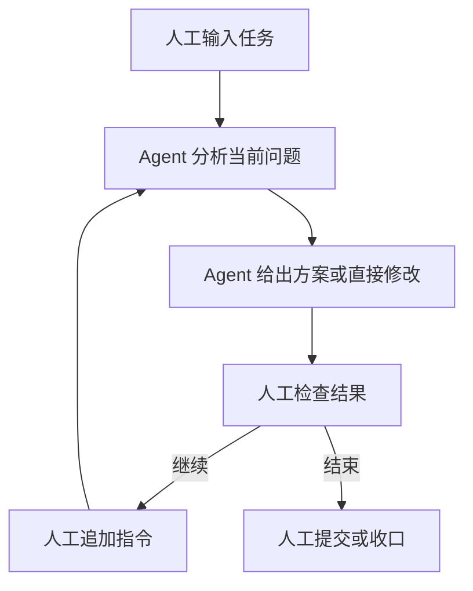
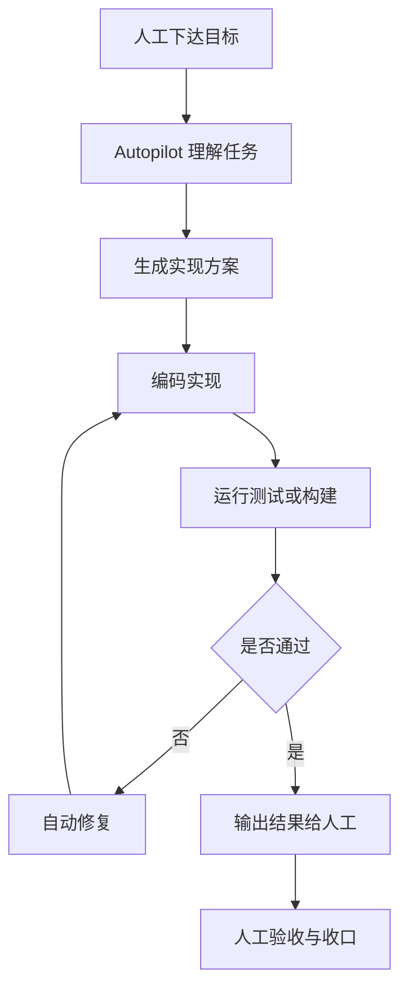
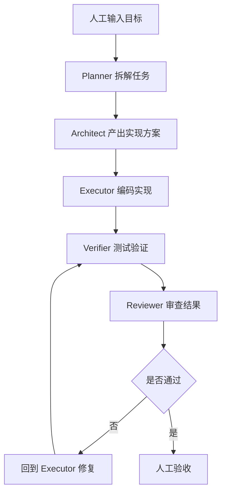
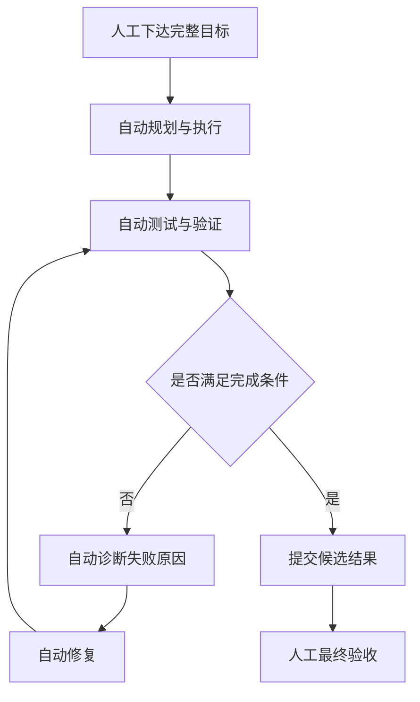
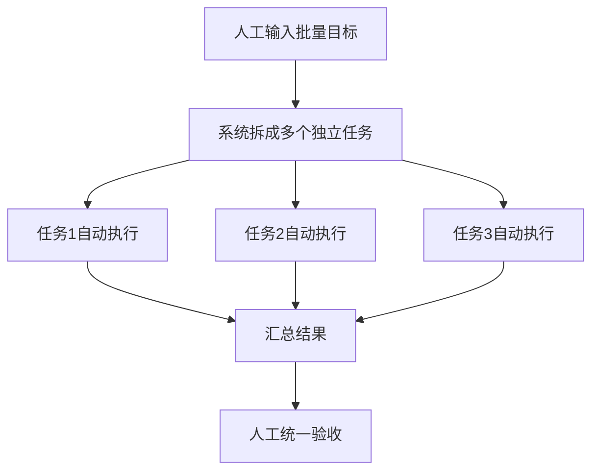
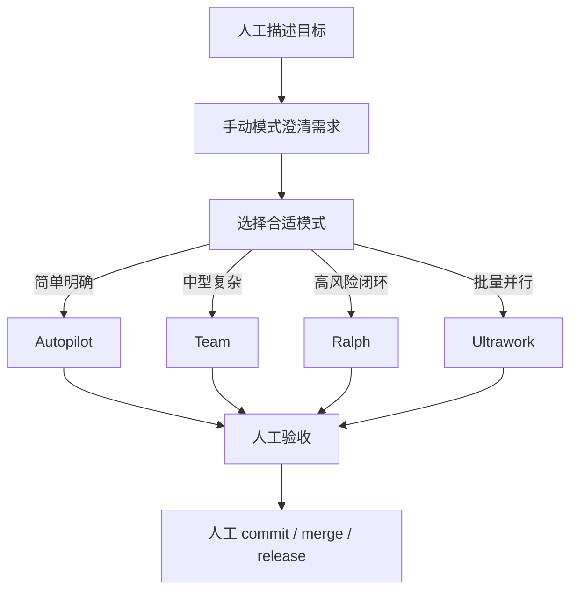

# OMC 使用

## 定位

OMC 可以理解成一个多 Agent 研发编排系统。它的重点不是“能不能写代码”，而是用不同模式组织需求、实现、验证和人工介入。

---

## 第一部分：模式边界总览

这是最先要看的部分。先判断模式边界，再选具体模式。

| 维度 | 手动模式 | Autopilot | Team | Ralph | Ultrawork |
|------|---------|-----------|------|--------|------------|
| 主导方式 | 人主导 | 单 Agent 主导 | 多 Agent 协作 | 自动闭环主导 | 并行任务主导 |
| 需求处理 | 人工澄清 | 自动初判 | 自动拆解 | 自动拆解 | 自动拆分 |
| 方案设计 | 弱 | 中 | 强 | 强 | 按任务而定 |
| 编码实现 | 有 | 强 | 强 | 强 | 强 |
| 测试验证 | 低 | 中 | 高 | 很高 | 中高 |
| 自动修复 | 低 | 中 | 中 | 很高 | 中 |
| 多角色协作 | 无 | 无 | 强 | 中强 | 强 |
| 并行能力 | 无 | 低 | 中 | 低到中 | 很高 |
| 人工控制力 | 很高 | 高 | 中 | 中低 | 中 |

### 快速结论

- 要控制感，用手动模式
- 要快速出一版，用 Autopilot
- 要分工协作，用 Team
- 要闭环验证，用 Ralph
- 要批量并行，用 Ultrawork

---

## 第二部分：模式详解

## 1. 手动模式

### 模式定义

你逐步驱动，Agent 负责响应和执行。

### 核心能力

- 精细修改
- 调试和 review
- 人工控制节奏和范围

### 流程图

### 自动 / 人工节点

| 节点 | 执行方 |
|------|-------|
| 问题理解 | 自动 |
| 局部代码修改 | 自动 |
| 是否继续下一步 | 人工 |
| 是否扩大任务范围 | 人工 |
| 是否接受结果 | 人工 |
| commit / push | 人工 |

### 适用判断

适合小改动、探索和需求未定的任务。

---

## 2. Autopilot

### 模式定义

单 Agent 顺序执行，从理解到实现再到基础验证。

### 核心能力

- 自动理解任务
- 自动编码
- 自动跑基础测试
- 自动修复常规错误

### 适用场景

- 新增一个明确功能
- 修一个边界清晰的 bug
- 做 PoC 或快速验证

### 流程图

### 自动 / 人工节点

| 节点 | 执行方 |
|------|-------|
| 需求初步理解 | 自动 |
| 方案草拟 | 自动 |
| 编码实现 | 自动 |
| 基础测试 / 构建 | 自动 |
| 常规报错修复 | 自动 |
| 判断需求是否偏了 | 人工 |
| 最终验收 | 人工 |
| commit / push | 人工 |

### 适用判断

适合边界清晰的单功能开发或 bug 修复。

---

## 3. Team 模式

### 模式定义

多 Agent 按角色分工，形成规划、实现、验证流水线。

### 核心能力

- 多角色协同
- 方案、实现、验证分离
- 适合中等复杂任务

### 典型角色

- planner：拆任务、排步骤
- architect：给结构方案
- executor：编码实现
- verifier / reviewer：测试、检查、验证

### 流程图

### 自动 / 人工节点

| 节点 | 执行方 |
|------|-------|
| 任务拆解 | 自动 |
| 技术方案 | 自动 |
| 代码实现 | 自动 |
| 测试验证 | 自动 |
| 代码审查 | 自动 |
| 判断目标是否拆对 | 人工 |
| 判断方案是否符合业务 | 人工 |
| 最终验收与合并 | 人工 |

### 适用判断

适合跨文件、跨模块、需要角色分工的任务。

---

## 4. Ralph 模式

### 模式定义

自动执行后持续验证，不通过就回环修复。

### 核心能力

- 自动执行
- 自动验证
- 自动诊断失败
- 自动回环修复

### 适用场景

- 改动风险高
- 测试要求高
- 你希望它尽量自修复，不要每一步都停下来问你

### 流程图

### 自动 / 人工节点

| 节点 | 执行方 |
|------|-------|
| 任务执行 | 自动 |
| 测试运行 | 自动 |
| 失败诊断 | 自动 |
| 回环修复 | 自动 |
| 完成证据整理 | 自动 |
| 判断验收标准是否合理 | 人工 |
| 死循环 / 误修复时介入 | 人工 |
| 最终上线决策 | 人工 |

### 适用判断

适合高风险改动和强验证任务。

---

## 5. Ultrawork

### 模式定义

把多个相对独立的任务并行推进。

### 核心能力

- 并行执行多个子任务
- 后台管理长任务
- 高吞吐处理
- 适合批量任务

### 适用场景

- 一批独立 bug 修复
- 多文件批量调整
- 多项检查 / 生成任务并行跑

### 流程图

### 自动 / 人工节点

| 节点 | 执行方 |
|------|-------|
| 子任务拆分 | 自动 |
| 并行执行 | 自动 |
| 后台任务管理 | 自动 |
| 结果汇总 | 自动 |
| 判断任务之间是否真独立 | 人工 |
| 冲突处理 | 人工 |
| 最终收口 | 人工 |

### 适用判断

适合批量、独立、可并行的任务。

---

## 第三部分：上手顺序

如果你现在正在实际使用 OMC，建议按这个顺序理解和上手：

1. 先掌握手动模式，理解 OMC 的基本行为边界
2. 再用 Autopilot，体验单 Agent 自动开发
3. 然后用 Team，理解多 Agent 分工
4. 再使用 Ralph，理解闭环验证
5. 最后再上 Ultrawork，处理批量并行任务

原因很简单：先理解单 Agent，再理解多 Agent，最后再理解闭环与并行。

---

## 第四部分：选型建议

| 场景 | 优先模式 |
|------|---------|
| 明确 bug 修复 | `Autopilot` |
| 中等复杂新功能 | `Team` |
| 高风险重构 | `Ralph` |
| 批量独立任务 | `Ultrawork` |
| 需求还没想清楚 | `手动模式` |

---

## 第五部分：自动化边界

### 适合自动化的节点

- 任务拆解
- 方案草拟
- 编码实现
- 测试执行
- 常规修复
- 初步 review

### 必须人工把关的节点

- 需求方向
- 业务优先级
- 范围变更
- 修复副作用
- 最终合并与发布

---

## 第六部分：推荐工作流

如果你是日常开发，不建议一上来就全自动。更稳妥的流程是：

---

## 第七部分：一句话总结

OMC 的模式选择，本质上是在回答三件事：谁主导、要不要闭环验证、要不要并行处理。
